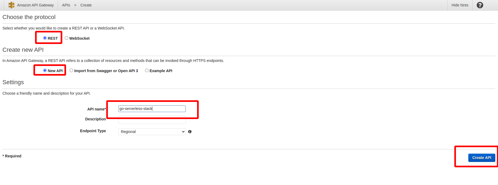

# Go-serverless-stack

### Build

```
cd ./cmd && go build -o ../build/main main.go
cd ../build && zip ./main.zip ./main
```


### AWS setup

1) Create lambda  
2) Change lambda function handlers  
3) Upload zip file to code source  
4) Go to ASW DynamoDB and create table  
5) Go to API Gateway and create REST API  
6) Create methods in API Gateway actions  
7) Deploy API in API Gateway actions  
8) Retrieve URL for testing functionality 

### Test

Import postman collection and send request to endpoints